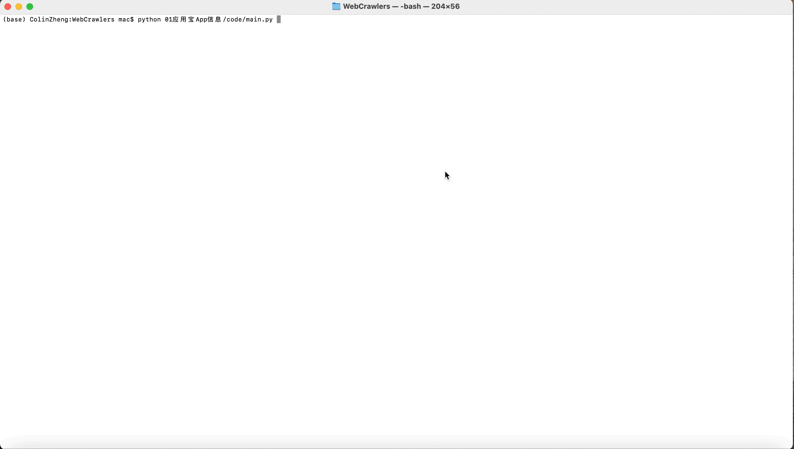

# 应用宝APP信息爬取

## 适用场景
目标是根据一个或多个已知的**APP或关键字**查找出相同类型或关联的其他APP，在一定程度上作为APP扩量的初筛池。方法是利用应用宝的搜索引擎，输入搜索关键字，将返回列表的APP信息整合，返回搜索关键字、APP名称、PKG名称、下载量、简单描述。（注意：若多个搜索关键字都返回同一APP信息，则该APP仅作为第一个匹配的搜索关键字的结果，i.e. 返回结果中不存在重复APP）

## 使用教程
1. [点击这里下载][1]下载WebCrawler项目

2. 确保以下库均安装
    ```python
	import sys
	import json
	import pandas as pd
	import time
	from bs4 import BeautifulSoup
	from selenium import webdriver
	from selenium.webdriver.support.ui import WebDriverWait
	from selenium.webdriver.support import expected_conditions as EC
    ```

3. 配置 *01应用宝App信息/code/config.json* 文件形如：
    ```javascript
        {
            "key_words":[
                "王者荣耀","刺激战场"
            ],
            "output_tag":"tencent_games"
        }
    ```
    其中 *key_words* 为目标关键字，使用应用宝搜索引擎返回关联APP； *output_tag* 为指定输出excel文件名称，输出文件到 *01应用宝App信息/result/* 中，若有相同文件路径则会覆盖。
    
3. 执行 *01应用宝App信息/code/main.py* Python3脚本
    ```python
	python3 WebCrawler/01应用宝App信息/code/main.py
    ```
4. 过程演示图片（若未显示，尝试使用代理后刷新页面）
    

5. 稍等 *key_words* 长度个弹窗后，检查 *01应用宝App信息/result/${output_tag}* 文件，格式为：
    

[1]:https://github.com/Colin-zh/WebCrawler/archive/main.zip
