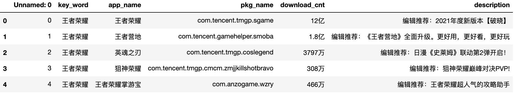

# 应用宝APP信息爬取
## 适用场景

## 使用教程
1. [点击这里下载][1]下载WebCrawler项目
2. 配置 *01应用宝App信息/code/config.json* 文件形如：
    ```javascript
        {
            "key_words":[
                "王者荣耀","和平精英"
            ],
            "output_tag":"tencent_games"
        }
    ```
    其中 *key_words* 为目标关键字，使用应用宝搜索引擎返回关联APP； *output_tag* 为指定输出excel文件名称，输出文件到 *01应用宝App信息/result/* 中，若有相同文件路径则会覆盖。
3. 执行 *01应用宝App信息/code/main.py* Python3脚本
    ```python
	python3 WebCrawler/01应用宝App信息/code/main.py
    ```
4. 过程演示图片
5. 稍等 *key_words* 长度个弹窗后，检查 *01应用宝App信息/result/${output_tag}* 文件，格式为：
    

[1]:https://github.com/Colin-zh/WebCrawler/archive/main.zip
