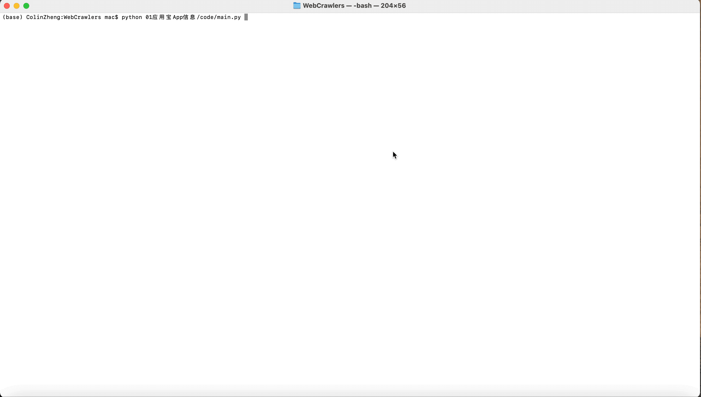
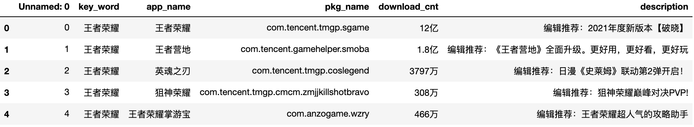
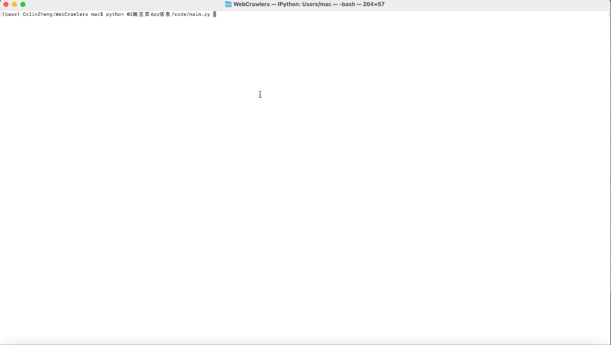
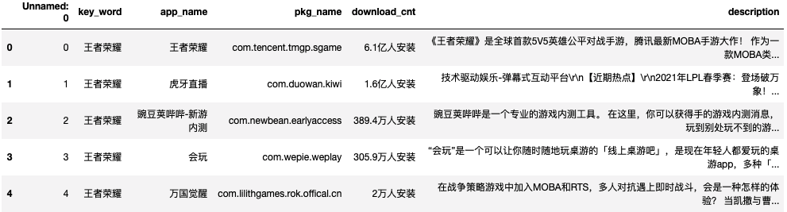

# <p align="center">工作中用到的一些python爬虫，结合业务场景说明使用</p>

<p align="center">
    <a href="https://github.com/Colin-zh/WebCrawler"></a>
    <a href="https://github.com/python/cpython"></a>
    <a href="https://opensource.org/licenses/mit-license.php"></a>
    <a href="https://github.com/Colin-zh/WebCrawler/graphs/contributors"></a>
    <a href="https://github.com/Colin-zh/WebCrawler/stargazers"></a>
    <a href="https://github.com/Colin-zh/WebCrawler/network/members"></a>
    <a href="https://www.python.org/"></a>
</p>
<br />

## 项目简介
工作中常见的网站爬虫例子，代码通用性较高，时效性较久。尽量用简单的python代码，并配有大量注释。

## 特此声明
无论是代理爬虫或者其他, 都不是一个有利于国家和社会的行为, 技术无罪, 人心难测。

## 使用说明
部分代码使用selenium，需要结合对应chrome驱动器使用，本人使用mac操作系统，win或linux请查阅相关文档说明
1. [点击这里下载][1]下载chrome浏览器
2. 查看chrome浏览器的版本号，[点击这里下载][2]对应版本号的chromedriver驱动
3. chrome浏览器对应版本的chromedriver下载至/usr/local/bin/目录下
4. pip安装下列包
```python
pip install selenium
```


# [1. 应用宝APP信息爬取][yyb]

## 适用场景
目标是根据一个或多个已知的**APP或关键字**查找出相同类型或关联的其他APP，在一定程度上作为APP扩量的初筛池。方法是利用应用宝的搜索引擎，输入搜索关键字，将返回列表的APP信息整合，返回搜索关键字、APP名称、PKG名称、下载量、简单描述。（注意：若多个搜索关键字都返回同一APP信息，则该APP仅作为第一个匹配的搜索关键字的结果，i.e. 返回结果中不存在重复APP）

## 使用教程
1. [点击这里下载][3]下载WebCrawler项目

2. 确保以下库均安装
    ```python
	import sys
	import json
	import pandas as pd
	import time
	from bs4 import BeautifulSoup
	from selenium import webdriver
	from selenium.webdriver.support.ui import WebDriverWait
	from selenium.webdriver.support import expected_conditions as EC
    ```

3. 配置 *01应用宝App信息/code/config.json* 文件形如：
    ```javascript
        {
            "key_words":[
                "王者荣耀","刺激战场"
            ],
            "output_tag":"tencent_games"
        }
    ```
    其中 *key_words* 为目标关键字，使用应用宝搜索引擎返回关联APP； *output_tag* 为指定输出excel文件名称，输出文件到 *01应用宝App信息/result/* 中，若有相同文件路径则会覆盖。
    
3. 执行 *01应用宝App信息/code/main.py* Python3脚本
    ```python
	python3 WebCrawler/01应用宝App信息/code/main.py
    ```
4. 过程演示图片（若未显示，尝试使用代理后刷新页面）
    

5. 稍等 *key_words* 长度个弹窗后，检查 *01应用宝App信息/result/${output_tag}* 文件，格式为：
    


# [2. 豌豆荚APP信息爬取][wdj]

## 适用场景
目标是根据一个或多个已知的**APP或关键字**查找出相同类型或关联的其他APP，在一定程度上作为APP扩量的初筛池。方法是利用豌豆荚的搜索引擎，输入搜索关键字，将返回列表的APP信息整合，返回搜索关键字、APP名称、PKG名称、下载量、简单描述。（注意：若多个搜索关键字都返回同一APP信息，则该APP仅作为第一个匹配的搜索关键字的结果，i.e. 返回结果中不存在重复APP）

## 使用教程
1. [点击这里下载][3]下载WebCrawler项目

2. 确保以下库均安装
    ```python
	import sys
	import json
	import pandas as pd
	import random
	import requests
	import progressbar
	from bs4 import BeautifulSoup
    ```

3. 配置 *02豌豆荚App信息/code/config.json* 文件形如：
    ```javascript
        {
            "key_words":[
                "王者荣耀","刺激战场"
            ],
            "output_tag":"tencent_games"
        }
    ```
    其中 *key_words* 为目标关键字，使用豌豆荚搜索引擎返回关联APP； *output_tag* 为指定输出excel文件名称，输出文件到 *02豌豆荚App信息/result/* 中，若有相同文件路径则会覆盖。
    
3. 执行 *02豌豆荚App信息/code/main.py* Python3脚本
    ```python
	python3 WebCrawler/02豌豆荚App信息/code/main.py
    ```
4. 过程演示图片（若未显示，尝试使用代理后刷新页面）
    

5. 稍等 *key_words* 长度个弹窗后，检查 *02豌豆荚宝App信息/result/${output_tag}* 文件，格式为：
    


[yyb]:https://github.com/Colin-zh/WebCrawler/tree/main/01%E5%BA%94%E7%94%A8%E5%AE%9DApp%E4%BF%A1%E6%81%AF
[wdj]:https://github.com/Colin-zh/WebCrawler/tree/main/02%E8%B1%8C%E8%B1%86%E8%8D%9AApp%E4%BF%A1%E6%81%AF

[1]:https://www.google.com/chrome/
[2]:http://chromedriver.storage.googleapis.com/index.html
[3]:https://github.com/Colin-zh/WebCrawler/archive/main.zip
