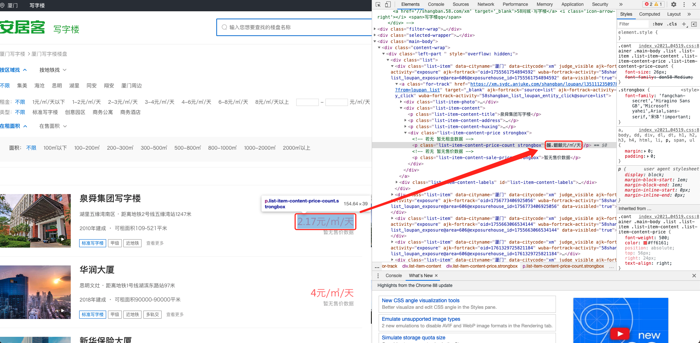
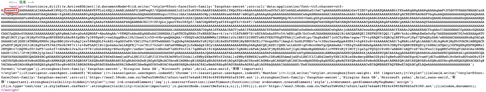
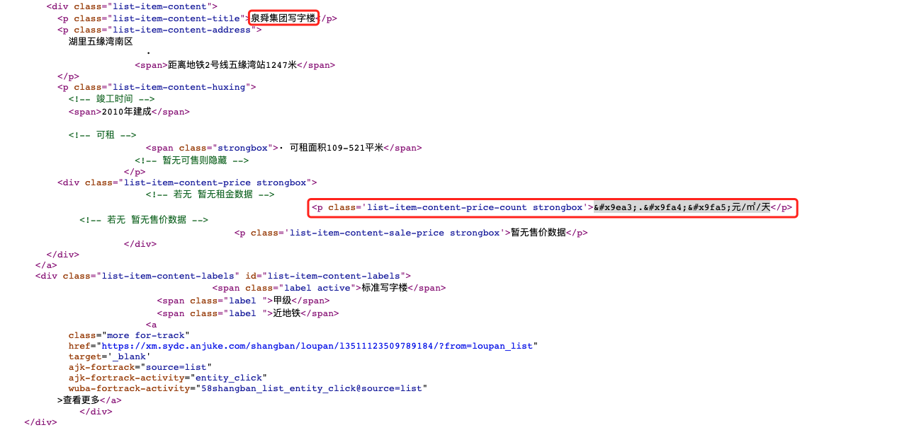

# 安居客数字解密

## 背景说明
在获取安居客写字楼楼盘信息时，通常会有数字内容源码部分被加密的问题，对于后续数据加工处理造成难度。样例如下：


## 使用说明
1. 确保以下库均已安装： 

    ```python
            import base64
            import re
            from io import BytesIO
            from fontTools.ttLib import TTFont 
    ```


## 编码思路
查看网页源代码后部分JavaScript中包含了解密钥匙，且加密方式为BASE64。


对应乱码表示为：


因此思路为：
1. 根据解密钥匙获取key_map

    ```python
            def get_keymap(html):
                """
                    对base64加密的页面内容进行解密
                """
                #获取密码
                keys_map = re.search(r'<script>!function\(w,d\)(.*?)<\/script>',html).group(1)
                #对密码解密转为map映射
                base64_str = re.search(r';base64,(.*?)\'\)', keys_map).group(1)
                font_content = base64.b64decode(base64_str)
                font = TTFont(BytesIO(font_content))
                keys = font.getBestCmap()
                keys = {hex(k)[2:] : str(int(v[-2:]) - 1) for k, v in keys.items()}
                return keys
    ```
    
2. 对加密价格执行替换
    
    ```python
            def keymap_replace(price,keys):
                #price = '&#x9a4b;.&#x9f92;&#x9f92;'
                for k, v in keys.items():
                    price = price.replace(f'&#x{k};', v)
                return price
    ```
    
## 举例
1. 首先对 *sample/keys.txt* 使用 *get_keymap(html)* 获取keymap，得到 *keys* 形如：
    
    ```python
            In [2]: keys                                                                   
            Out[2]: 
            {'9476': '8',
             '958f': '6',
             '993c': '3',
             '9a4b': '5',
             '9e3a': '4',
             '9ea3': '2',
             '9f64': '9',
             '9f92': '0',
             '9fa4': '1',
             '9fa5': '7'}
    ```
        
3. 最后对 *sample/secret_price.txt* 使用 *keymap_replace(price,keys) 得到最终解密结果为：

    ```python
            In [3]: price = '&#x9ea3;.&#x9fa4;&#x9fa5;元/㎡/天'                            

            In [4]: keymap_replace(price,keys)                                             
            Out[4]: '2.17元/㎡/天'
    ```
   
   对比图一中显示价格部分，结果一致。
