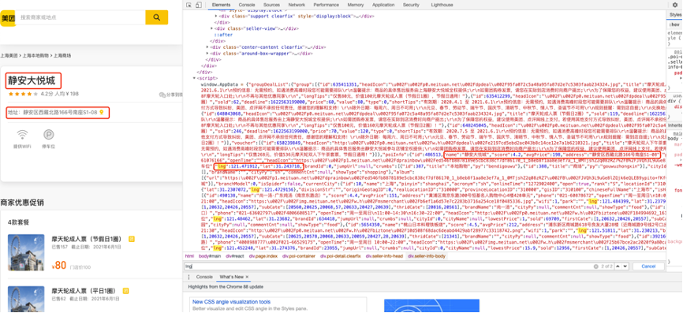
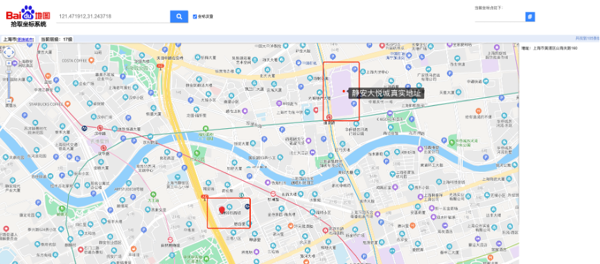
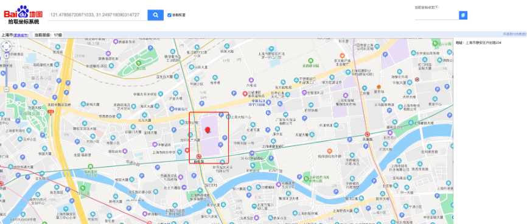

# 腾讯坐标系转百度坐标系

## 背景说明
在获取美团商圈信息时，在获取商圈名称及消费水平时，经纬度的精确性同时也必不可少。公司内部使用以百度坐标系为基准的机制，因此需要进行坐标系转化。

## 使用样例
1. 确保以下库均已安装： 

    ```python
        import math
    ```


2. 查看网页源代码后部分JavaScript中包含了位置的信息


   获取到结果：
   
   ```python
        { ”name”:”静安大悦城”,”address”:”静安区西藏北路166号南座S1-08”,”lng”:121.471912,”lat”:31.243718}
   ```

3. 而将上述对应经纬度放入百度拾取坐标系系统，发现存在lbs飘飞：

    
4. 将经纬度进行转换
    
    ```python
            def tx2bd(lng,lat):
                import math
                x_pi = (3.14159265358979324 * 3000.0) / 180.0
                x,y = float(lng),float(lat)
                z = math.sqrt( x * x + y * y) + 0.0002 * math.sin(y * x_pi)
                theta = math.atan2(y, x) + 0.000003 * math.cos(x * x_pi)
                lng = z * math.cos(theta) + 0.0065
                lat = z * math.sin(theta) + 0.006
                return (lng, lat)
    ```
   
   获取百度坐标系对应位置为：
   
   ```python
            { ”lng”:121.47856720971033,”lat”:331.249719090314727}
   ```

5. 在百度拾取坐标系系统中搜索对应坐标，结果一致：

